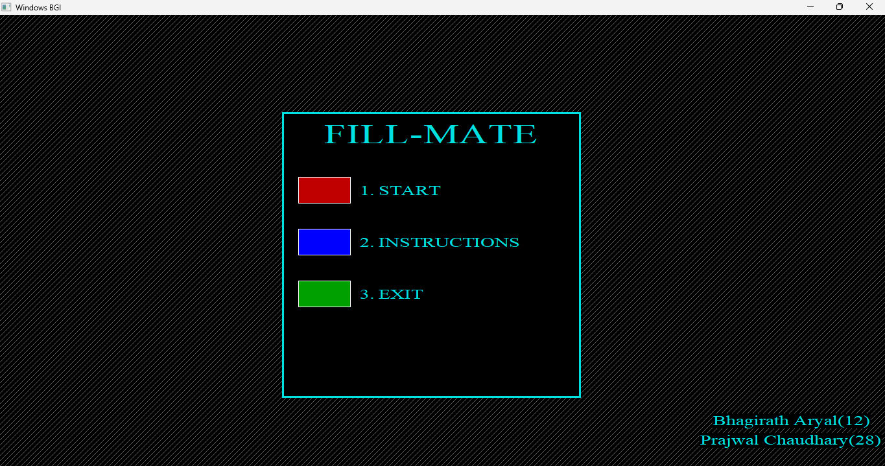
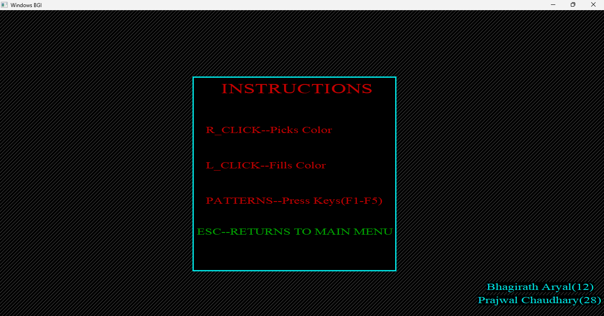
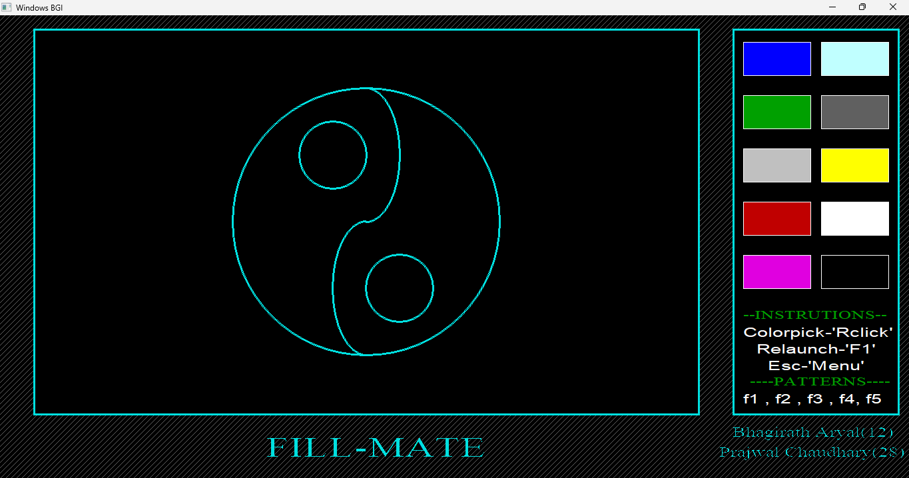
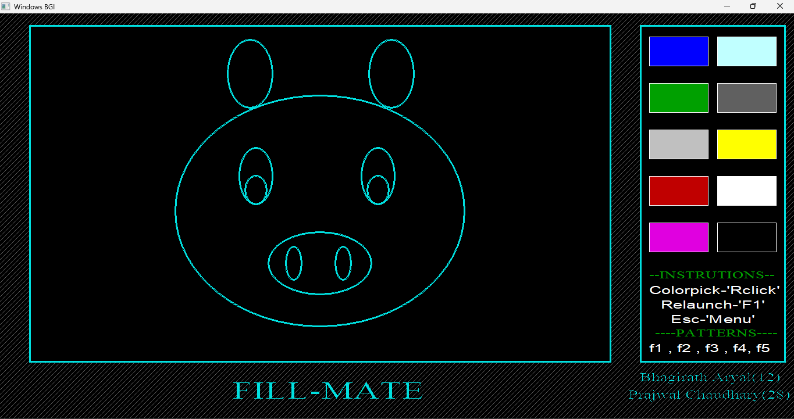
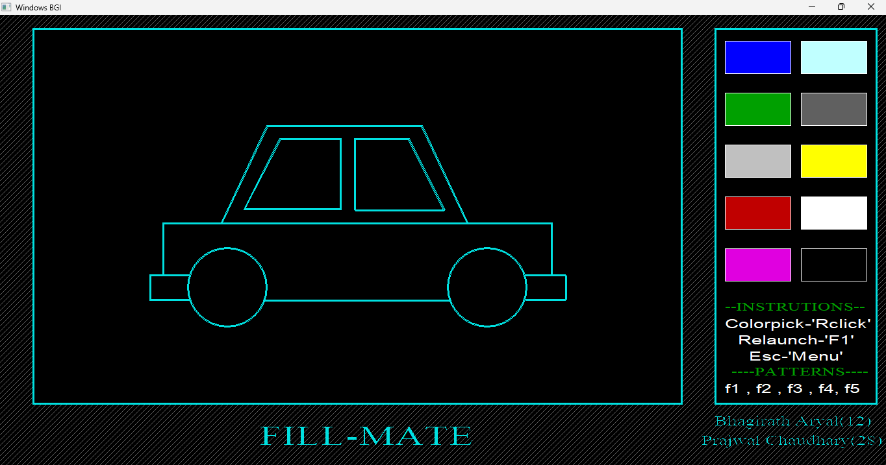
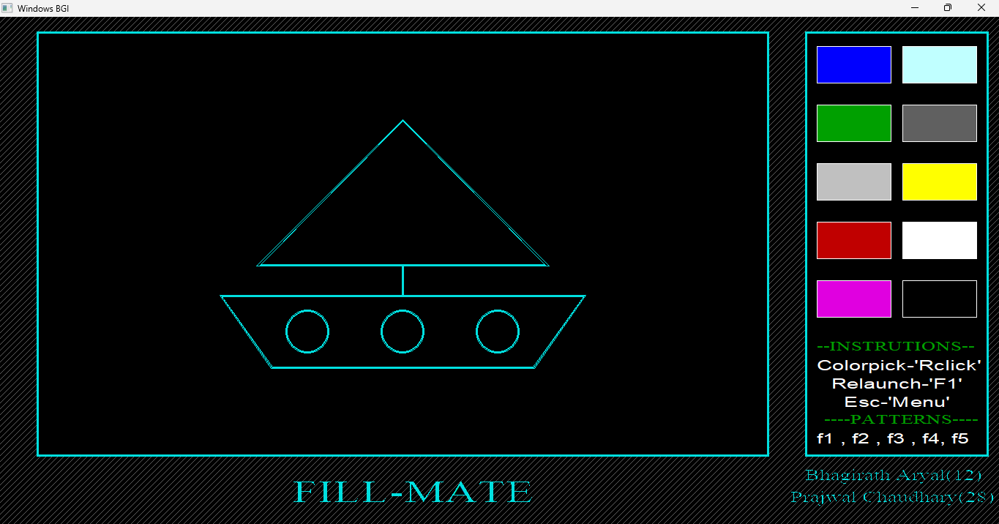
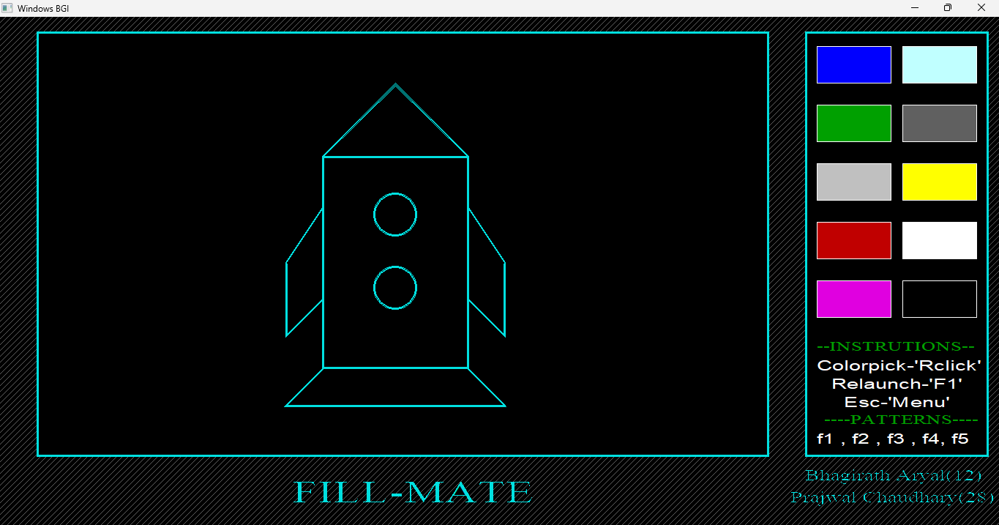
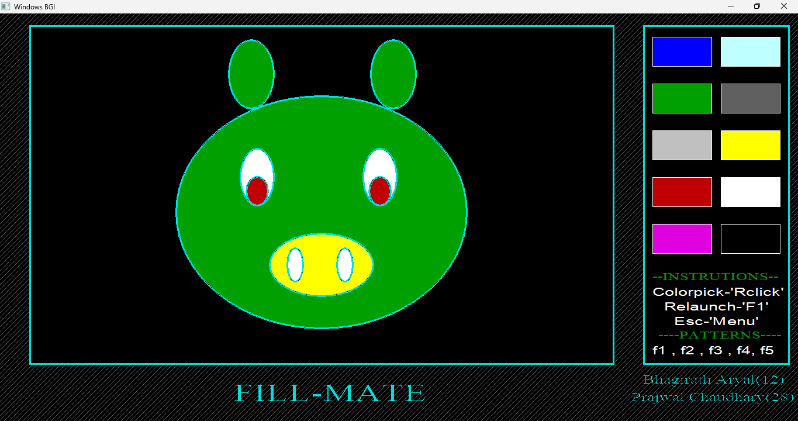

# FillMate -an interactive color filling application

## Table of Contents
- [Introduction](#introduction)
- [Instructions](#instructions)
- [Setup](#setup)
- [Overview](#overview)
- [Filling Drawing](#filling-drawings)
- [COntributors](#contributors)
- [Contact](#contact)


## Introduction
This project was done as a project for **Computer Graphics** subject. It is an interactive color filling application specially designed for kids. It consists of five different drawings and the drawings can be filled with different color from the control box. 

## Instructions
- **R_Click:** picks up the color
- **L_Click:** fills color
- **(F1-F5) KEYS** changes drawing
- **ESC key:** Returns to main menu

## Setup
1. clone this repo
    ```
    git clone https://github.com/PrajwalChaudhary25/FILLMATE.git
    ```

2. open the file **FILLMATE.exe**


## Overview
This section guides you through **gimpses** of this application.

### Home window
This is the entry point of the application


### Instructions window


### Drawings window
- Yin-Yang **(F1 key)**


- Piggy **(F2 key)**


- Car **(F3 key)**


- Yatch **(F4 key)**


- Rocket **(F5 key)**


### Filling Drawings
Pick up color from the **control box** on the right side using **R_click** and press **L_click** on the part of the drawing where you want to apply the color.



## Demo Video
Click here for [Demo Video](https://drive.google.com/file/d/1IS2EOAG1i33yGVBN3w_UDBpd32ktL9jQ/view?usp=sharing)

## Contributors
- Bhagirath Aryal (THA078BCT012)
- Prajwal Chaudhary (THA078BCT028)

## Contact
For any queries or feedback, please contact: [prajwalchy25@gmail.com](mailto:prajwalchy25@gmail.com)